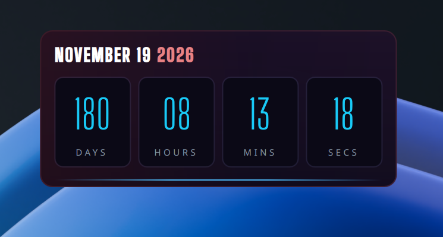

# Launch Countdown — KDE Plasma 6 Widget

A sleek desktop countdown widget for KDE Plasma 6. Configurable target date, accent color. Default is GTA VI launch date on November 19, 2026.



## Requirements

- **KDE Plasma 6** (Plasma 5 is not supported — uses the new `PlasmoidItem` API)
- **Qt 6**
- *(Optional)* Font **"Big Shoulders"**. The widget falls back gracefully to a condensed sans-serif if it isn't installed.

### Install the optional font

Grab it from Google Fonts and drop the TTFs in your local font folder:

[Download link Big Shoulders](https://fonts.google.com/specimen/Big+Shoulders?family=Big+Shoulders+Stencil+Display&preview.script=Latn)

## Install the widget

### Option A — Drop-in install (recommended)

```bash
# From the folder containing this README:
kpackagetool6 --type Plasma/Applet --install local.launchcountdown
```

Then **right-click your desktop -> "Edit Mode..." -> "Add or manage objects..." -> search "Launch Countdown" -> click or drag onto desktop.**

### Option B — Manual install

Copy the folder into your local plasmoid path:

```bash
mkdir -p ~/.local/share/plasma/plasmoids/
cp -r local.launchcountdown ~/.local/share/plasma/plasmoids/
kquitapp6 plasmashell && kstart plasmashell
```

## Configure

Right-click the widget -> **Configure Launch Countdown…**

| Setting | Default | Notes |
|---|---|---|
| Target date | `2026-11-19T00:00:00` | ISO format, local time |
| Accent color | `#19d2ff` | Hex; applied to the numerals |
| Show seconds | on | Hide to only show hours and minutes |

## Uninstall

```bash
kpackagetool6 --type Plasma/Applet --remove local.launchcountdown
```

## Update after editing

If you tweak the QML:

```bash
kpackagetool6 --type Plasma/Applet --upgrade local.launchcountdown
# then either re-add the widget, or:
kquitapp6 plasmashell && kstart plasmashell
```

## Troubleshooting

**Widget doesn't appear in "Add Widgets":** run `kbuildsycoca6` and reopen the panel.

**Crashes / blank widget:** check `journalctl --user -f` while plasmashell starts. Most often it's a Plasma 5 vs 6 mismatch — this widget is **Plasma 6 only**.

**Font looks plain:** Big Shoulders Stencil Display isn't installed. See the font section above, or edit `contents/ui/main.qml` and change `stencilFamily` to any condensed display font you have.

## License

MIT — do what you like.
